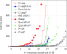
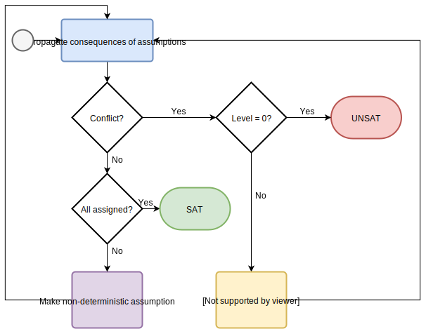
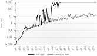
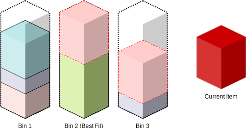
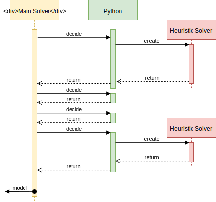

Answer Set Programming (*ASP*) 

* is a declarative programming paradigm
* provides a means to easily model hard combinatorial search problems

::: notes
Declarative
: Describe programs in terms of "what" rather than "how"

Easy Modelling
: Saving development cost
:::

-----

ASP has been used for modelling e.g.

- Industrial Configuration Problems [@aschinger_optimization_2011]
- Curriculum-Based Course Timetabling [@banbara_teaspoon:_2016]
- Artificial Music Composition [@boenn_automatic_2011]

. . .

Many more can be found in [@falkner_industrial_2018]

::: notes
@aschinger_optimization_2011 investigate the Partner Units Problem. A number of zones and sensors need to be managed by control units with limited resources. How to assign those elements to units?

CB-CTT is about assigning lectures to time slots under a set of hard (e.g. room availability, curriculum conflicts) and soft constraints (room capacity, travel distance) arising from the domain in education.

@boenn_automatic_2011 describes a system that can automatically compose music based on known rules of harmony, melody, and rhythm in near real-time.
:::

------

@aschinger_optimization_2011 tested ASP against other general purpose approaches on the PUP.

   System     Instances Solved (of 48)
  ---------  --------------------------
     SAT                            13
     CSP                            35
   **ASP**                      **39**
    CPLEX                           21

------

No silver bullet, complex instances can still be prohibitively slow

. . .

Domain-specific heuristics may help!

------

## Why Heuristics?

* Specialized solvers outperform ASP
* The QuickPup solver [see @teppan_quickpup:_2012] was able to solve all instances it was benchmarked on, ASP at the time was not
* Clingo 5.3 still only solves around 70% of the PUP instances in the ASP competition set in our benchmarks

------

### PUP with HWASP

{style="border:none; box-shadow:none"}

Equipped with a domain-specific heuristic written directly into the solver, @musitsch_improving_2016 was able to solve 100% of tested PUP instances

------

How to teach an ASP solver a new heuristic?

. . .

Modern ASP solvers use some variation of the CDCL algorithm

------

{style="border:none; box-shadow:none; width:60%"}

<!-- evaluate diagram vs code?

```python
if unitPropagation(φ,ν) == conflict:
    return UNSAT
while not all variables assigned:
    literal = decide(φ,ν)
    ν = ν ∪ {literal}
    if unitPropagation(φ,ν) == conflict:
        β = conflictAnalysis(φ,ν)
        if (β < 0):
            return UNSAT
        else:
            backtrack(φ,ν,β)
return SAT
```
-->

. . .

There is a non-deterministic decision to be made in each iteration!

-------

Let us call the method "`decide`". The decision can be made in a variety of ways

* General purpose heuristics like *VSIDS* or *BerkMin*
* or *domain-specific* heuristics

# History {data-background-color="#a30"}

Domain-specific heuristics in ASP are not new

## Clingo Domain Heuristics

Domain heuristics for Clingo introduced in @gebser_domain-specific_2013

* Allows influencing the general purpose heuristic via modifiers
* It is fully declarative

------

@calimeri_combining_2015 used this interface to attack the Combined Configuration Problem.

1. A greedy algorithm is presented to calculate an approximate solution first
2. The "solution" is handed to the solver by giving the solution atoms a higher heuristic value
3. The solver is then expected to sort out any remaining problems

------

## CCP Evaluation
{style="border:none; box-shadow:none; width:70%"}

The combined Greedy & ASP approach was able to solve all 100 instances, versus 54 plain.

------

However, **expressivity** is limited due to evaluation semantics.

. . .

e.g. a simple bin packing heuristic already requires *fixing an ordering upfront*.

------

### Best-Fit Bin Packing

{style="border:none; box-shadow:none"}

* Packing item into best bin requires knowledge of current packing
* Aggregate cannot be calculated until *all placements are known*
* Workaround results in exponential blowup

::: notes

* Bin Packing is the problem of fitting a number of sized items into a number of uniformly sized bins
* Best-Fit picks a bin such that the amount of leftover space is minimal
* Depends on prior assignment!
* Aggregates in heuristic bodies are calculated w.r.t. *final answer set*
* Rules do not fire when needed
* Workaround here relies on ordering. In the general case, all subsets of the aggregate set need to be generated.

:::

------


## HWasp

@dodaro_driving_2016 present a low-level interface to the WASP solver, allowing the implementation of domain specific heuristics.

------

@musitsch_improving_2016 demonstrates great improvements over general purpose heuristics on industrial problems.

 Problem   Clasp  Best Heuristic
--------- ------ ---------------
PUP         23              36
CCP          3              36

------

Purely procedural interface, requiring knowledge of solver internals, as well as rebuilding the solver.

::: notes
A Python interface exists, but still requires knowledge of the solver internals
:::

# Declarative Heuristics {data-background-color="#582"}

-------

So far we have

* a **declarative** approach with limited expressivity
* a procedural option which is difficult to **write and maintain**.

. . .

Can we do better?

-------

We want to use ASP to describe heuristics for ASP.

. . .

→ Use a second solver!

## How it works

+ User defines two programs
    1. *Main* program
    2. *Heuristic* program
* The heuristic is computed separately *as needed* to make decisions in the *main* solver.
* Main solver tells the heuristic about changes, so it can adapt.
* Repeat until a solution is found.

## Overview

{style="box-shadow:none; border:none; width:60%"}

## Proof Of Concept

* We expose `decide` from Clasp for external implementation (C or Python)
* The external heuristic keeps its own state, does not care about solver internals
* Can also register as a propagator to receive updates on watched literals
* Our Proof-of-Concept is an external heuristic written in Python handling a second heuristic solver
* Registers and manages watched literals as required
* Handles caching of decisions

## Language

Two Heuristic Parts
: Split between background knowledge and decision procedure

Special Atoms
: `vsids` and `resign`

Persistence
: `#persist` can be used to remember decisions between invocations

:::notes
`vsids` switches to VSIDS for *one* decision, `resign` is permanent.
:::


------

Watching
: `#watch` synchronizes an atom from the main program with the heuristic program. Defines inputs to a heuristic.

Decisions
: `#heuristic` marks heuristic rules. Rules are weighted like weak constraints to allow fast choice of *best* decision among many.

## Example

```prolog
1 { place(I,B) : bin(B) } 1 :- item(I,_).
:- bin(B), capacity(C), F > C, 
    F = #sum { S,I : item(I,S), place(I,B) }.

#program dynamic_heuristic.
#watch place/2.

placed(I) :- place(I,_).

#heuristic place(I,B) : 
    bin(B), item(I,W), capacity(C), not placed(I),
    S = #sum { X,I1 : place(I1,B), item(I1,X) }, 
    C >= S + W. [S+I@0, true]
```

::: notes
Note that there is no ordering required in the aggregate, and that there is a negative literal in the body
:::

## Observations

+ Fully declarative
+ Negation behaves as ASP users expect
* Aggregates can *always* get evaluated

------

Thank you for your attention

------

## References { style="font-size:12pt" }
